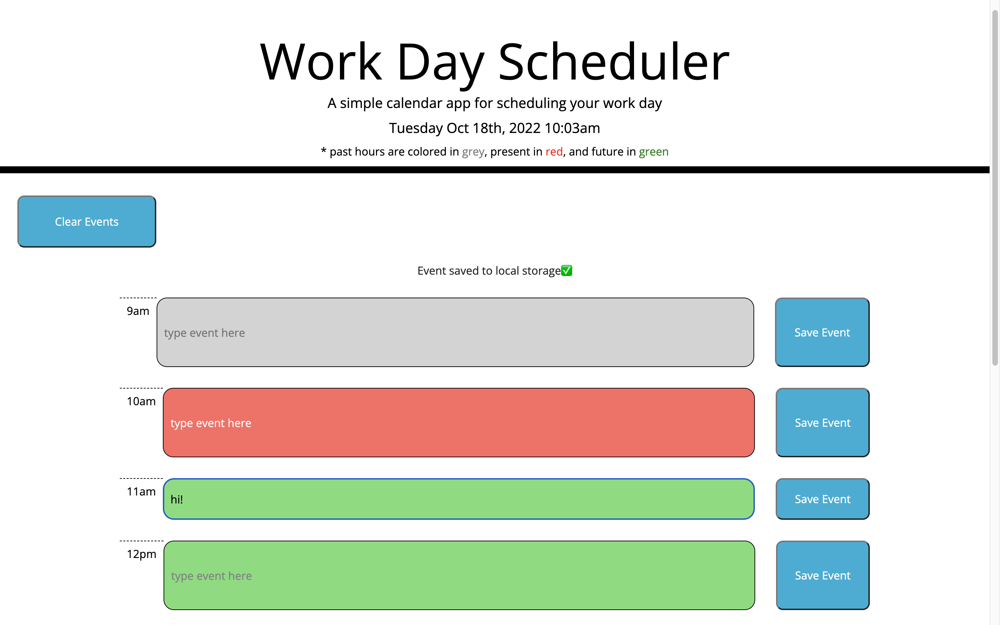

# event-scheduler
A simple work day event scheduler application

## Description

This project was created to demonstrate how useful jQuery can be in the form of coding a work day scheduler. jQuery allows developers to write complex JavaScript functions much simpler. It allows for us to write less code but get more done. jQuery is also a library full of methods and other code we can use in our projects. Overall, it is a fun way to write simple code, making our code look cleaner and have it run smoother in the browser. Local storage was also used again, which is a powerful tool that allows users to store data only they can see in their browser. This time, local storage was accessed using jQuery and used to save the user's events in a key/value pair inside the browser. The events are then displayed in their respective input field after the user saves it, even on a page refresh.

During this project, I learned many new methods as well as ways to write vanilla JavaScript methods in jQuery's simpler format. Writing with jQuery, I was able to manipulate the DOM much easier. It made my final code look clean and organized. I also learned about moment.js and how I can use it to grab real date and time values. Lastly, I learned more about local storage, what it can do, and how to use it. Again, this code and logic can be used in future projects, especially if I am writing jQuery code.

## Usage

Upon clicking the link to the webpage (see "Links" below), the user will be directed to a single webpage containing "time block" input fields, one for each hour of the work day (9am - 5pm). The current date and time are displayed on top of the page (in the header) and will update on page refresh. You will notice the time blocks are colored, indicating if that time block's hour is in the past, present, or future. Past times are colored in grey, present in red, and future in green. You can then enter an event and press the "Save Event" button, which will save the event to local storage, confirm with a message, and keep the event text on page even after a refresh. If you try to press the save button without entering text, a message will appear asking you to please enter an event. You can also clear the text in all input fields by clicking the "Clear Events" button. You are allowed to add to your events even after you have already entered one.

## Links

Website URL: https://scottsc0de.github.io/event-scheduler/

GitHub Repo: https://github.com/ScottsC0de/event-scheduler

## Video

https://user-images.githubusercontent.com/56902166/196488080-507feb4a-8d85-4821-8a2c-1d4a0cd2be44.mov

## Screenshot

